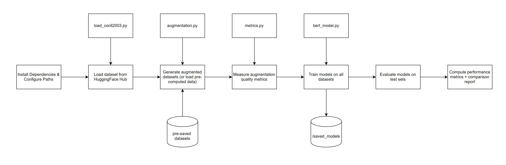

# Analyzing Failures of Data Augmentation for Low-Resource NER

**EN.705.641.81 Final Project, Group 2**  
Jacob Cunningham, Angela Zhao, Boyan Zhou

## Overview

This repository implements a comprehensive analysis of data augmentation techniques for Named Entity Recognition (NER) in low-resource settings. The project trains BERT models on the CoNLL-2003 NER dataset and evaluates four data augmentation methods:

1. **EDA (Easy Data Augmentation)** - Synonym replacement, word swapping, and deletion on non-entity tokens
2. **Entity Replacement** - Entity-aware augmentation using a knowledge base of entity substitutions
3. **Back Translation** - Forward and backward machine translation for paraphrase generation
4. **Contextual MLM** - Masked language model-based augmentation preserving entity information

The project systematically measures augmentation quality metrics (span corruption rate, label flip rate) and evaluates their impact on model performance across full and low-resource (10% subsampled) settings.

### Key Features

- **Baseline Comparison**: Full vs. 10% subsampled dataset training
- **Quality Metrics**: Comprehensive analysis of augmentation quality and its correlation with model performance
- **Pre-computed Datasets**: Augmented datasets are cached for efficient reuse
- **Flexible Evaluation**: Per-type F1 scores, precision, recall, and detailed error analysis
- **GPU-Ready**: Optimized for both local training and cloud execution (Google Colab)

---

## Project Structure

```
src/
├── driver.ipynb                     # Full experiment (interactive)
├── data/
│   ├── load_conll2003.py            # Dataset loading and subsampling
│   ├── augmentation.py              # Data augmentation implementations
│   └── augmented_datasets/          # Pre-computed augmented datasets
│       ├── eda/
│       ├── entity_replacement/
│       ├── back_translation/
│       └── contextual_mlm/
├── model/
│   └── bert_model.py                # BERT NER model wrapper
├── metrics/
│   └── metrics.py                   # Evaluation metrics and quality analysis
├── saved_models/                    # Any fine-tuned models from previously run experiments (none initially)
├── results/                         # Experiment results (JSON)
└── test/                            # Unit tests for components
```

---

## Quick Start

### Prerequisites

- Python 3.12
- CUDA 11.8+ (for GPU support, optional for local development)
- ~4GB disk space for datasets and models
- Git LFS

### Option 1: Local Setup

#### 1. Clone the Repository

```bash
git clone https://github.com/yourusername/ner_data_augmentation_error_analysis.git
cd ner_data_augmentation_error_analysis
```

#### 2. Create Conda Environment

```bash
conda env create -f environment.yml
conda activate ssm_final
```

The environment includes:
- PyTorch 2.0+
- Transformers 4.30+
- Hugging Face Datasets 2.14.7
- Additional dependencies: scikit-learn, pandas, numpy, seqeval

**For CUDA Support (Recommended):**  
If you have CUDA installed, install PyTorch with CUDA support:

```bash
# For CUDA 11.8
pip install torch torchvision torchaudio --index-url https://download.pytorch.org/whl/cu118

# For CUDA 12.1
pip install torch torchvision torchaudio --index-url https://download.pytorch.org/whl/cu121

# For CPU only
pip install torch torchvision torchaudio
```

Check GPU availability:
```bash
python -c "import torch; print(f'GPU Available: {torch.cuda.is_available()}')"
```

#### 3. Option 1: Run Experiments Locally

**Option A: Run individual modules or test suites**
Example: Running the test suite for metrics.py
```bash
cd src/test
python test_metrics.py
```

**Option B: Run Jupyter notebook** (full, interactive analysis)
```bash
cd src
jupyter notebook driver.ipynb
```

### Option 2: Google Colab (Recommended for GPU Access)

[Google Colab](https://colab.research.google.com/) provides free GPU access and is ideal for this project.

#### Steps to Run in Colab:

1. **Open Colab**: Go to https://colab.research.google.com/

2. **Create a new notebook** or use our pre-configured notebook:
   - Open the `driver.ipynb` file from this repository
   - Click "Open in Colab" button (if available)
   - Or upload the notebook manually

3. **In Colab, run the first cell** (which clones the repository):
   ```python
   GITHUB_REPO = "https://github.com/yourusername/ner_data_augmentation_error_analysis.git"
   BRANCH = "main"
   
   !git clone --branch {BRANCH} {GITHUB_REPO}
   %cd ner_data_augmentation_error_analysis/src
   ```

4. **Select GPU Runtime** (optional but recommended):
   - Click **Runtime** → **Change runtime type**
   - Set **Hardware accelerator** to **GPU** (T4 or A100 if available)
   - Click **Save**

5. **Run all cells**: 
   - Click **Runtime** → **Run all** (or press Ctrl+F9)
   - The notebook will:
     - Install dependencies
     - Load/create augmented datasets
     - Train baseline and augmented models
     - Generate comprehensive results

**Estimated Runtime:**
- Generating new augmented datasets (optional): ~90-100 minutes
- Full dataset (14k+ samples): ~30-45 minutes on T4 GPU
- 10% subsampled (1.4k samples): ~8-12 minutes on T4 GPU

#### Why We Recommend Running on Colab:
- Free GPU access (T4, V100, or A100)
- Pre-installed popular ML libraries
- No setup required
- Session storage (no Google Drive mounting needed)
- Easy to share results

---

## Running the Driver Notebooks

### Notebook Workflow

`driver.ipynb` follows this workflow:

1. **Environment Setup** - Install dependencies, configure paths
2. **Dataset Loading** - Load CoNLL-2003 from Hugging Face Hub
3. **Data Augmentation** - Generate augmented versions (or load pre-computed)
4. **Quality Metrics** - Measure augmentation quality:
   - Span corruption rate
   - Label flip rate
   - Token perturbation rate
5. **Model Training** - Train BERT models on:
   - Baseline (no augmentation)
   - EDA augmentation
   - Entity replacement
   - Back translation
   - Contextual MLM
6. **Evaluation** - Compute F1, precision, recall per entity type
7. **Results Summary** - Generate comprehensive comparison report

### Experiment Architecture Diagram


*A larger diagram can be viewed by accessing architecture_diagram.jpg directly*

### Key Parameters

You can customize the experiment by modifying notebook cells:

```python
# Dataset configuration
sample_rate = 0.1  # 10% subsampling

# Training parameters
num_epochs = 3
batch_size = 32
learning_rate = 2e-5

# Augmentation parameters
alpha = 0.1  # Perturbation probability for EDA
synonym_dict_size = 200  # Size of EDA synonym dictionary
```

### Output Files

After running a notebook, results are saved to:

```
src/
├── data/augmented_datasets/  # Pre-computed augmented datasets (cached)
├── saved_models/             # Fine-tuned BERT models
└── results/
    └── augmentation_experiment.json
```

Example results JSON:
```json
{
  "models": {
    "baseline": {
      "training": {
        "training_time": 1234.56,
        "train_samples": 14041,
        "val_samples": 3250
      },
      "evaluation": {
        "eval_f1": 0.9234,
        "eval_precision": 0.9145,
        "eval_recall": 0.9325
      }
    },
    "eda_augmented": {
      "training": { ... },
      "augmentation_quality": {
        "span_corruption_rate": 0.0234,
        "label_flip_rate": 0.0012,
        "token_perturbation_rate": 0.0456
      },
      "evaluation": { ... }
    }
  }
}
```

---

## Installation Details

### Environment Dependencies

The project requires the following key packages (see `environment.yml` for full list):

| Package | Version | Purpose |
|---------|---------|---------|
| Python | 3.12 | Core language |
| PyTorch | ≥2.0.0 | Deep learning framework |
| Transformers | ≥4.30.0 | HuggingFace BERT models |
| Datasets | 2.14.7 | Hugging Face dataset loading |
| scikit-learn | ≥1.0.0 | ML utilities |
| seqeval | ≥1.2.2 | Sequence labeling evaluation |
| numpy/pandas | Latest | Data processing |

### Installing Manually

If you prefer to install packages manually:

```bash
# Create virtual environment
python -m venv venv
source venv/bin/activate  # On Windows: venv\Scripts\activate

# Install PyTorch (choose based on your system)
pip install torch>=2.0.0 torchvision>=0.15.0 torchaudio>=2.0.0

# Install other dependencies
pip install transformers>=4.30.0 datasets==2.14.7 pandas numpy pytest
pip install accelerate>=0.20.0 scikit-learn>=1.0.0 seqeval>=1.2.2
```

---

## Understanding the Code

### Main Components

#### 1. **Data Loading** (`src/data/load_conll2003.py`)
```python
from load_conll2003 import load_conll2003_dataset, subsample_dataset

# Load full CoNLL-2003 dataset
dataset = load_conll2003_dataset()

# Create 10% subsampled version
subsampled = subsample_dataset(dataset, sample_rate=0.1)
```

#### 2. **Data Augmentation** (`src/data/augmentation.py`)
```python
from augmentation import (
    augment_naive_eda,
    augment_entity_aware,
    augment_contextual_mlm,
    augment_back_translation
)

# EDA augmentation (safest for entity preservation)
aug_tokens, aug_labels = augment_naive_eda(
    tokens=tokens,
    labels=labels,
    synonym_dict=synonym_dict,
    alpha=0.1  # Perturbation probability
)

# Entity-aware replacement
aug_tokens, aug_labels = augment_entity_aware(
    tokens=tokens,
    labels=labels,
    entity_kb=entity_kb
)
```

#### 3. **BERT NER Model** (`src/model/bert_model.py`)
```python
from bert_model import create_bert_ner_model

# Create model (9 NER tags)
model = create_bert_ner_model(num_labels=9)

# Prepare dataset
train_dataset = model.prepare_dataset(raw_dataset['train'])

# Train
results = model.train(
    train_dataset=train_dataset,
    eval_dataset=eval_dataset,
    num_epochs=3,
    per_device_batch_size=32,
    learning_rate=2e-5
)

# Evaluate
eval_results = model.evaluate(test_dataset)
```

#### 4. **Evaluation Metrics** (`src/metrics/metrics.py`)
```python
from metrics import per_type_f1_scores

# Compute per-entity-type F1 scores
scores = per_type_f1_scores(predictions, references)
# Returns: {'PER': 0.92, 'LOC': 0.88, 'ORG': 0.85, 'MISC': 0.80}
```

---

## Testing

Run unit tests to verify components:

```bash
cd src
pytest test/ -v
```

Test files:
- `test/test_load_conll2003.py` - Dataset loading
- `test/test_augmentation.py` - Augmentation methods
- `test/test_bert_model.py` - Model functionality
- `test/test_metrics.py` - Evaluation metrics

---

## Troubleshooting

### Common Issues

**Issue: Out of Memory (OOM)**
```
CUDA out of memory. Tried to allocate X.XX GiB
```
**Solution:**
- Reduce batch size: `batch_size = 16` instead of 32
- Use gradient accumulation steps in Colab
- Use the 10% subsampled version: `driver_subsampled.ipynb`

**Issue: ImportError when running notebooks**
```
ImportError: No module named 'transformers'
```
**Solution:**
- Ensure environment is activated: `conda activate ssm_final`
- In Colab, restart kernel: **Runtime** → **Restart runtime**

**Issue: Slow data loading from Hugging Face Hub**
```
Loading dataset from Hugging Face Hub takes >5 minutes
```
**Solution:**
- This is normal on first run (downloads ~150MB)
- Subsequent runs use cached data
- In Colab, datasets persist within the session

**Issue: CUDA/GPU not detected**
```
No GPU available, will use CPU
```
**Solution:**
- Check CUDA installation: `nvidia-smi`
- Verify PyTorch CUDA: `python -c "import torch; print(torch.cuda.is_available())"`
- In Colab: **Runtime** → **Change runtime type** → Select **GPU**

---

## Citation

If you use this code for research, please cite:

```bibtex
@misc{cunningham2026augmentation,
  title={Analyzing Failures of Data Augmentation for Low-Resource NER},
  author={Cunningham, Jacob and Zhao, Angela and Zhou, Boyan},
  year={2026},
  howpublished={Johns Hopkins University, EN.705.641.81 Final Project}
}
```

---

## License

This project is licensed under the MIT License - see [LICENSE](LICENSE) file for details.

---

## Resources

- [Hugging Face Transformers Documentation](https://huggingface.co/docs/transformers/)
- [CoNLL-2003 Dataset](https://huggingface.co/datasets/conll2003)
- [BERT Paper](https://arxiv.org/abs/1810.04805)
- [Google Colab Guide](https://colab.research.google.com/notebooks/intro.ipynb)
- [PyTorch Documentation](https://pytorch.org/docs/)
